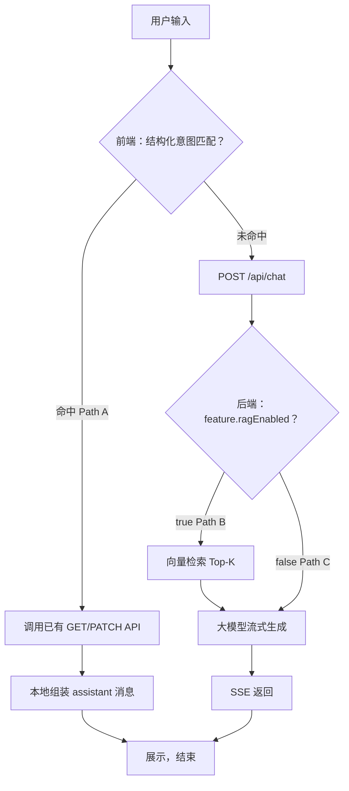

# 对话回答路由 — 设计文档

> **文档版本**：v0.4  
> **日期**：2026-07-06  
> **状态**：草案（Phase 4 规划）  
> **关联**：[API-PROTOCOL.md](./API-PROTOCOL.md) §6.5（协议契约） · [RAG-DESIGN.md](./RAG-DESIGN.md)（知识库与 RAG） · [PRD-FEATURES.md](./PRD-FEATURES.md)（M10）

---

## 1. 问题与原则

用户提问并非都应走大模型。站点内存在三类数据源：

| 类型 | 特征 | 正确做法 |
|------|------|----------|
| **结构化** | 字段固定，API 可精确查询 | 直查 API + 模板回复 |
| **非结构化知识** | 长文 Markdown/文章，语义检索 | RAG + 大模型 |
| **开放任务** | 闲聊、写作、无自有数据源 | 纯大模型 |

**原则**

1. **能 API 直查的，不调大模型**（零 token、零幻觉、毫秒级）
2. **需要读长文资料的，RAG + 大模型**（Feature `ragEnabled=true`）
3. **创作/闲聊类，纯大模型**（Feature `ragEnabled=false`）
4. **「未命中关键字」≠ 自动 RAG**；是否 RAG 由 **Feature / 场景** 决定

---

## 2. 三段式路由

### 2.1 总览



### 2.2 三条路径对照

| 路径 | 名称 | 是否调 LLM | 是否 RAG | 触发条件 |
|------|------|------------|----------|----------|
| **A** | 结构化直答 | 否 | 否 | 前端意图注册表命中 + 有对应 API |
| **B** | 知识库问答 | 是 | 是 | 未走路径 A，且 `feature.ragEnabled=true` |
| **C** | 通用对话 | 是 | 否 | 未走路径 A，且 `feature.ragEnabled=false` |

> Path B 中，RAG 无命中时**仍调大模型**，Prompt 指示「知识库无相关资料，勿编造」。

---

## 3. Path A — 结构化直答（前端）

### 3.1 职责边界

| 层级 | 职责 |
|------|------|
| **前端** | 关键字/规则匹配 → 调已有 REST API → 模板化回复 → **不**调用 `POST /api/chat` |
| **后端** | 提供结构化数据 API（已存在）；Phase 4c 可选迁移意图判断至 `chat.ts` |

MVP 阶段 Path A **仅在前端**实现，与现有 `ownerProfile`、`userProfile` 一致。

### 3.2 意图注册表（Structured Intent Registry）

配置位置（规划）：`src/lib/chatRouting/registry.ts`

```typescript
/** 结构化意图域 — 命中则 Path A，不走大模型 */
interface StructuredIntentDomain {
  /** 唯一 ID，用于日志与测试 */
  id: StructuredIntentId
  /** 人类可读说明 */
  description: string
  /** 匹配函数：同步，纯规则，不调 API */
  match: (text: string, context: RoutingContext) => boolean
  /** 命中后执行的处理器 */
  handler: StructuredIntentHandler
  /** 优先级：数字越小越先匹配（避免「主人」与「用户」冲突） */
  priority: number
}

type StructuredIntentId =
  | 'owner_profile'   // 已实现：src/lib/ownerProfile.ts
  | 'user_profile'    // 已实现：src/lib/userProfile.ts
  | 'user_quota'      // 规划：配额查询
  | 'knowledge_ingest' // 规划：对话写入知识库（Phase 4b）

interface RoutingContext {
  recentMessages: ChatMessage[]
  user: UserPublic | null
}

type StructuredIntentHandler = (
  text: string,
  context: RoutingContext,
) => Promise<StructuredReply | null>

/** 直答结果；null 表示降级到 Path B/C */
interface StructuredReply {
  content: string
  /** 可选：来源标注，便于 UI 展示「来自站点资料」 */
  source?: 'owner_profile' | 'user_profile' | 'quota' | 'knowledge_ingest'
}
```

### 3.3 已注册域（v0.1 规划）

| id | 匹配概要 | 数据 API | 实现文件 | 状态 |
|----|----------|----------|----------|------|
| `owner_profile` | 主人/站长 + 身高体重爱好等 | `GET /api/site/owner-profile` | `src/lib/ownerProfile.ts` | ✅ 已有 |
| `user_profile` | 自我介绍、个人资料问答/保存 | `GET/PATCH /api/user/profile` | `src/lib/userProfile.ts` | ✅ 已有 |
| `user_quota` | 「还剩几次」「我的额度」 | `GET /api/auth/me` | 待建 | 📋 规划 |
| `knowledge_ingest` | 「保存到知识库：」「记住：」「录入知识：」+ 正文 | `POST /api/knowledge/bases/:kbId/documents` | 待建 | 📋 Phase 4b |

### 3.3.1 结构化写入 vs 知识库写入

| 用户说 | 意图 | 存储位置 | 是否 RAG |
|--------|------|----------|----------|
| 「我身高 175」 | `user_profile` | UserProfile 表字段 | 否，Path A 直答 |
| 「保存到知识库：项目背景…」 | `knowledge_ingest` | KnowledgeDocument → Chunk | 入库后 Path B 可检索 |
| 「主人爱好游泳」 | `owner_profile` | SiteOwnerProfile | 否 |

知识库对话写入须带明确前缀（如「保存到知识库：」），且 `knowledge_ingest` 优先级低于 `user_profile` / `owner_profile`，避免与改资料冲突。

### 3.4 关键字策略

- **MVP**：正则 + 关键词列表（与现实现一致）
- **不做**：用关键字决定是否 RAG（RAG 由 Feature 控制）
- **扩展**：新结构化域 = 注册表新增一项 + 对应 API + 单元测试

### 3.5 前端 sendMessage 伪代码

```typescript
async function sendMessage(text: string, formData?: Record<string, string>) {
  // Path A：结构化直答
  const structured = await resolveStructuredIntent(text, { recentMessages: messages, user })
  if (structured) {
    appendLocalMessages(userMessage, structured)
    return
  }

  // Path B / C：交给后端
  await streamChat({ featureId, model, message: text, formData, sessionId })
}
```

### 3.6 Path A 的协议特点

- **无**独立 HTTP 对话接口
- **不**消耗 `quotaUsed`（不调 LLM；是否单独计次由产品决定，默认不计）
- 回复格式与普通 `ChatMessage` 相同，UI 无差异
- 可选：assistant 消息 metadata 增加 `replySource: 'structured'`（Phase 4b，仅 localStorage）

### 3.7 对话入库 vs 大模型对话 — 识别规则（实现清单）

> 用户在同一条输入里，系统必须在 `POST /api/chat` **之前**判定是 **Ingest（上传）** 还是 **Query/Chat（问答/闲聊）**。

#### 3.7.1 判定流程

```
sendMessage(text)
  → resolveStructuredIntent（按 priority 升序）
  → 命中 knowledge_ingest？ → 上传，return（无 POST /api/chat）
  → 未命中 → streamChat → 后端 ragEnabled？ → RAG+LLM 或 纯 LLM
```

#### 3.7.2 入库前缀（必须匹配其一才走 knowledge_ingest）

| 前缀 | 正则建议 | 示例 |
|------|----------|------|
| `保存到知识库：` | `/^保存到知识库[：:]\s*/` | `保存到知识库：默认端口 3000` |
| `录入知识：` | `/^录入知识[：:]\s*/` | `录入知识：项目背景…` |
| `添加到知识库：` | `/^添加到知识库[：:]\s*/` | `添加到知识库：FAQ 条目` |

**不推荐单独使用** `记住：` 作为入库前缀（与「记住我叫张三」等 profile 口语冲突）。若启用须 priority 低于 `user_profile` 且正文长度 ≥ 20 字。

前缀后的全文作为 `content`；`title` 默认「对话录入 YYYY-MM-DD HH:mm」或首行 ≤ 40 字。

#### 3.7.3 误判对照表

| 用户输入 | 期望路径 | 原因 |
|----------|----------|------|
| `保存到知识库：pm2 部署` | **上传** Path A `knowledge_ingest` | 命中强制前缀 |
| `Q2 复盘写了什么？` | **问答** Path B（kb-chat） | 无前缀，走 chat + RAG |
| `你好` | **闲聊** Path C（free-chat） | 无前缀，无 RAG |
| `我身高 175` | **改资料** Path A `user_profile` | priority 高于 ingest |
| `记住端口 3000`（无前缀） | **非上传** | 不满足入库前缀 → 走 chat |
| `保存到知识库：`（空正文） | **拒绝** | 校验失败，提示补全内容 |

#### 3.7.4 上传成功回复文案（固定模板）

```
已保存至《{title}》，正在建立索引…
```

索引完成后（轮询或 WebSocket 前）可追加：

```
索引完成，共 {chunkCount} 段。可在「知识库问答」中检索。
```

失败：

```
保存失败：{errorMsg}。请检查权限或稍后重试。
```

#### 3.7.5 可观测性

| 路径 | Network | replySource |
|------|---------|-------------|
| 上传 | `POST /api/knowledge/.../documents`，**无** `/api/chat` | `structured` |
| RAG 问答 | `POST /api/chat` SSE，可有 `citations` | `rag` |
| 纯 LLM | `POST /api/chat` SSE，无 `citations` | `llm` |

#### 3.7.6 与 Feature 的关系

- 带入库前缀的消息：**一律 Path A**，与当前 `featureId` 无关（即使正在 `kb-chat` 也不会误走 RAG 问答）。
- 无前缀的消息：由 `featureId` + `ragEnabled` 决定 Path B/C。

---

## 4. Path B — RAG + 大模型（后端）

### 4.1 触发

- 前端 Path A 未命中
- 请求 `POST /api/chat`，且 `feature.ragEnabled === true`（如 `kb-chat`）

### 4.2 流程

见 [RAG-DESIGN.md §5.1](./RAG-DESIGN.md)。

### 4.3 与 Path A 的关系

- 用户问「主人多高」→ Path A，**即使**当前 Feature 是 `kb-chat` 也不 RAG
- 用户问「Q2 复盘写了什么」→ Path A 不命中 → 若 Feature 为 `kb-chat` → Path B

---

## 5. Path C — 纯大模型（后端）

### 5.1 触发

- 前端 Path A 未命中
- `POST /api/chat`，且 `feature.ragEnabled === false`（如 `free-chat`、`doc-generate`）

### 5.2 典型场景

| Feature | 用途 |
|---------|------|
| `free-chat` | 闲聊、通用问答 |
| `doc-generate` | 表单 + 模板生成文档 |
| `tech-qa` | 代码/报错分析（无知识库） |

---

## 6. Feature 与路由的关系

```
Path A 优先于 Feature（前端短路，请求到不了后端）
  └─ 例外：featureId=ask-owner 时，跳过 isOwnerRelatedQuery（见 §6.2）

Path B vs C 仅由 Feature.ragEnabled 决定（后端）
```

### 6.1 双能力并存（产品主界面）

| Feature | 名称 | 路径 | 用途 |
|---------|------|------|------|
| `ask-owner` | 了解主人 | **B** RAG + LLM | 问站长：身高、经历、技术等 |
| `free-chat` | 自由对话 | **C** 纯 LLM | 闲聊、写作、通用问答 |
| `doc-generate` 等 | 文档生成等 | **C** | 现有能力保留 |

- **新会话默认** `free-chat`（BR-OWNER-01）
- **了解主人** 与 **自由对话** 均在 Feature 列表展示，文案区分用途
- 详见 [RAG-DESIGN.md §3.5](./RAG-DESIGN.md)

### 6.2 `ask-owner` 与 owner Path A 的例外规则

| 条件 | `isOwnerRelatedQuery` | 实际路径 |
|------|----------------------|----------|
| `featureId !== 'ask-owner'` | 命中 → Path A 本地直答 | 现状保留 |
| `featureId === 'ask-owner'` | **跳过**，不短路 | Path B：RAG + LLM |
| `ask-owner` + KB 空/检索无命中 | — | 可选 fallback Path A（profile API） |

**实现**：`ChatContext.sendMessage` 开头：

```typescript
if (featureId !== 'ask-owner' && isOwnerRelatedQuery(trimmed, messages)) {
  // 现有 owner Path A
}
```

### 6.3 路由对照表

| 用户操作 | featureId | Path A 命中 | 实际路径 |
|----------|-----------|-------------|----------|
| 「站长多高」 | `ask-owner` | 不短路 | **B** RAG |
| 「站长多高」 | `free-chat` | 可命中 owner | **A** 或 **C**（现状：A） |
| 「写一首诗」 | `free-chat` | 否 | **C** |
| 「解释 React」 | `free-chat` | 否 | **C** |
| 「我身高 175」 | 任意 | user_profile | **A**（改登录用户资料） |
| 「保存到知识库：…」 | 任意 | knowledge_ingest | **A**（advanced，非站长主路径） |

**会话级约定**：一个 `ChatSession` 绑定一个 `featureId`；从「了解主人」切到「自由对话」建议新建会话。

### 6.4 业务规则（Owner Bio）

| 规则 ID | 描述 |
|---------|------|
| BR-OWNER-01 | 新会话默认 `free-chat` |
| BR-OWNER-02 | `ask-owner` 仅检索 `owner-public` KB |
| BR-OWNER-03 | `free-chat` 禁止 RAG |
| BR-OWNER-04 | 切换 Feature 建议新建 session |
| BR-OWNER-05 | 站长资料保存后须 reindex 后 `ask-owner` 才反映新内容 |
| BR-OWNER-06 | `ask-owner` 下跳过 `isOwnerRelatedQuery` Path A |

---

## 7. 演进路线

| 阶段 | Path A | Path B | Path C |
|------|--------|--------|--------|
| **现状** | 前端 owner/user profile | 未实现 | `POST /api/chat` |
| **Phase 4a** | user_profile；owner 仅在非 ask-owner | **ask-owner** + owner-public | **free-chat** 等 |
| **Phase 4b** | + knowledge_ingest（optional） | + citations | 不变 |
| **Phase 4c** | 可选后端意图路由 | Hybrid 检索 | Agent 工具（另议） |

### 7.1 后端意图路由（Phase 4c 可选）

将 Path A 迁至 `node/src/routes/chat.ts` 时：

- 新增响应模式：`Content-Type: application/json`（非 SSE）用于结构化直答
- 或 SSE 单事件 `structured_reply`（与流式统一）

详见 [API-PROTOCOL.md §6.5.4](./API-PROTOCOL.md)。

---

## 8. 业务规则

| 规则 ID | 描述 |
|---------|------|
| BR-ROUTE-01 | Path A 仅用于**有明确 API 与字段**的结构化数据；长文知识不得走路径 A |
| BR-ROUTE-02 | Path A 在前端 `sendMessage` 中**先于** `POST /api/chat` 执行 |
| BR-ROUTE-03 | 是否 RAG（Path B vs C）由 `feature.ragEnabled` 决定，**不由**关键字推断 |
| BR-ROUTE-04 | Path A 命中时**禁止**调用 `POST /api/chat` 与大模型 |
| BR-ROUTE-05 | 新增结构化域须注册 `StructuredIntentDomain` 并补充测试用例 |
| BR-ROUTE-06 | Path B 检索无命中仍走大模型，并约束勿编造（见 RAG Prompt） |
| BR-OWNER-01 | 新会话默认 `free-chat` |
| BR-OWNER-02 | `ask-owner` 仅检索 `owner-public` |
| BR-OWNER-03 | `free-chat` 禁止 RAG |
| BR-OWNER-04 | 切换 Feature 建议新建 session |
| BR-OWNER-05 | 站长资料保存后须 reindex |
| BR-OWNER-06 | `ask-owner` 下跳过 `isOwnerRelatedQuery` Path A |

---

## 9. 测试验收

### Path A

- [ ] 「主人身高」+ `free-chat` → 可走 owner Path A（现状）
- [ ] 「主人身高」+ `ask-owner` → **走 RAG**，无 owner Path A 短路

### Path B（ask-owner · RAG 实现后）

- [ ] `ask-owner` + 问站长身高/经历 → 与 owner-public 资料一致
- [ ] `ask-owner` 无 `POST /api/chat` 前的 owner Path A 短路
- [ ] `free-chat` 闲聊无 citations

### Path C

- [ ] `free-chat` → 正常流式，无 `citations`
- [ ] 默认新会话为 `free-chat`

---

## 10. 设计变更记录

| 版本 | 日期 | 变更摘要 | 负责人 |
|------|------|----------|--------|
| v0.1 | 2026-07-06 | 初版：三段式路由、意图注册表、与 RAG/Feature 关系 | — |
| v0.2 | 2026-07-06 | §3.3：`knowledge_ingest` 对话入库；结构化 vs RAG 写入区分 | — |
| v0.3 | 2026-07-06 | §3.7：对话入库 vs 大模型识别规则、前缀清单、误判表、回复文案 | — |
| v0.4 | 2026-07-06 | §6：ask-owner 与 free-chat 并存；ask-owner 跳过 owner Path A | — |

---

## 11. 相关文档

| 文档 | 用途 |
|------|------|
| [API-PROTOCOL.md §6.5](./API-PROTOCOL.md) | 前后端协议：路由规则、类型、响应模式 |
| [RAG-DESIGN.md](./RAG-DESIGN.md) | Path B 知识库、索引、检索 |
| [PRD-FEATURES.md §M10](./PRD-FEATURES.md) | 产品需求与验收 |
