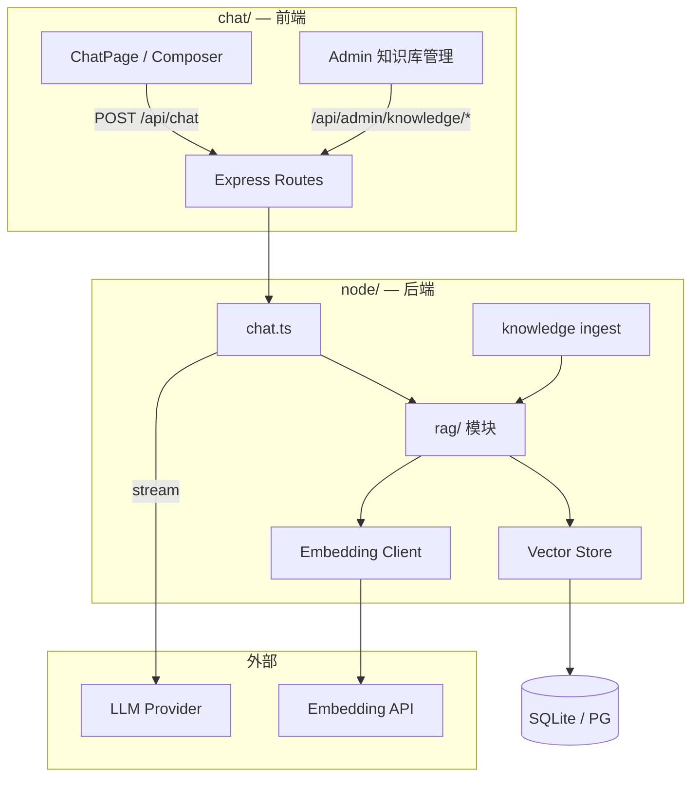
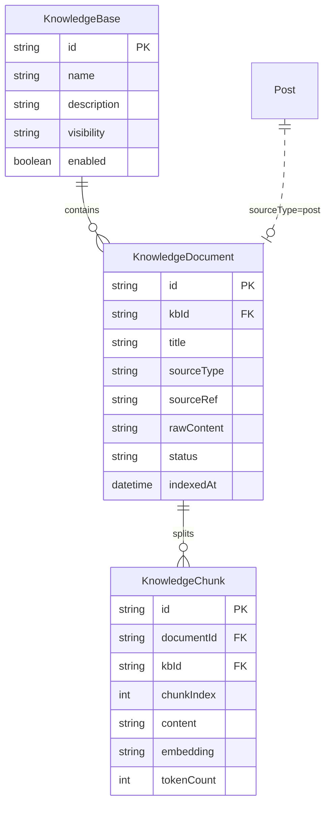

# RAG 信息检索 — 设计文档

> **文档版本**：v0.5  
> **日期**：2026-07-06  
> **状态**：草案（Phase 4 规划）  
> **关联**：[DESIGN.md](./DESIGN.md)（总体架构） · [API-PROTOCOL.md](./API-PROTOCOL.md)（接口契约） · [CHAT-ROUTING.md](./CHAT-ROUTING.md)（回答路由） · [PRD-FEATURES.md](./PRD-FEATURES.md)（功能需求）

---

## 1. 背景与目标

### 1.1 背景

当前对话链路（`node/src/routes/chat.ts`）将 Feature 的 `systemPrompt` 与历史消息直接拼装后调用上游 LLM，模型仅依赖预训练知识与对话上下文，**无法回答站点私有资料**（如博客文章、内部文档、项目说明）。

RAG（Retrieval-Augmented Generation）通过在生成前检索相关知识片段并注入 Prompt，使回答**有据可依、可引用来源**，是 [DESIGN.md §1.3](./DESIGN.md) Phase 4 规划中的差异化能力之一。

### 1.2 目标

| 目标 | 说明 |
|------|------|
| **有据回答** | 基于知识库内容作答，资料不足时明确说明，减少幻觉 |
| **双能力并存** | **了解站长**（RAG 生平库）与 **自由对话**（纯大模型）分 Feature，均保留 |
| **低侵入接入** | 复用现有 `POST /api/chat` SSE 协议；RAG 逻辑全部在后端 |
| **与 Feature 体系融合** | 通过 Feature 开关 RAG、绑定知识库、定制 Prompt |
| **小体量可运行** | 50～200 用户、数千 chunk 规模；SQLite 起步，可平滑升级 |
| **成本可控** | Embedding 走现有 one-api 网关；不引入 LangChain 全家桶（MVP） |

### 1.2.1 核心产品场景（Owner Bio KB）

| 角色 | 能力 | 说明 |
|------|------|------|
| **站长** | 维护公开资料 | 设置页：基本信息 + 简历上传；保存后自动索引至 `owner-public` KB |
| **访客** | 了解站长 | Feature **`ask-owner`**：问身高、经历、技术等 → RAG + 大模型 |
| **所有人** | 通用 AI 对话 | Feature **`free-chat`** 等：闲聊、写作、技术问答 → 纯大模型，**不查**生平库 |

> 详见 [§3.5 站长公开生平](#35-站长公开生平owner-bio-kb--核心场景)。

### 1.3 非目标（v1）

| 项 | 说明 |
|----|------|
| 多模态 RAG（图片/PDF OCR） | v1 仅支持纯文本；PDF 需先转文本 |
| Agent 工具调用 | 与 RAG 独立，Phase 4 后期再评估 |
| 前端直连向量库 | 密钥与检索逻辑必须在服务端 |
| 实时协作编辑知识库 | v1 管理端 CRUD + 异步索引即可 |

### 1.4 回答路由（与 RAG 的关系）

RAG 仅是 **Path B**（知识库问答），不是全部非结构化问题的默认路径。完整三段式路由见 **[CHAT-ROUTING.md](./CHAT-ROUTING.md)**：

| 路径 | 说明 |
|------|------|
| **A 结构化直答** | 关键字命中 + API 直查，**不调大模型**（主人/用户资料等） |
| **B RAG + 大模型** | `feature.ragEnabled=true`，本文档主体 |
| **C 纯大模型** | `feature.ragEnabled=false`，闲聊/文档生成 |

**未命中 Path A 时，是否 RAG 由 Feature 决定，不由关键字推断。**

---

## 2. 总体架构

### 2.1 逻辑架构



### 2.2 两条链路

#### 离线入库（Ingest）

```
文档来源 → 清洗 → 分块(chunk) → Embedding → 写入 KnowledgeChunk
```

触发方式：管理端手动上传 / 从 Post 同步 / API 触发重建索引。

#### 在线检索（Query）

```
用户消息 → Embedding(query) → Top-K 检索 → 拼装 system prompt → LLM 流式生成
```

插入点：`chat.ts` 构造 `upstreamMessages` 之前（见 §5.1）。

### 2.3 与现有模块关系

| 现有模块 | 关系 |
|----------|------|
| `Feature` | 扩展 `ragEnabled`、`ragKbIds` 等字段，控制是否检索及目标知识库 |
| `Post` | 第一版知识来源；管理端「从文章导入」 |
| `POST /api/chat` | 协议不变；RAG 仅影响服务端 system 内容 |
| `quota` | 每轮 RAG 多一次 Embedding 调用；prompt token 增加计入现有限额 |
| `providers/` | 新增独立 Embedding client，协议 OpenAI-compat |

---

## 3. 分阶段交付

### 3.1 Phase 4a — MVP（以 Owner Bio 为先）

| 项 | 内容 |
|----|------|
| **核心场景** | 站长公开生平库 `owner-public` + Feature `ask-owner` |
| 知识来源 | 设置页 profile 同步《基本信息》+ 简历粘贴（admin） |
| 向量存储 | SQLite JSON 存 embedding + 内存余弦相似度 |
| Feature | **`ask-owner`**（RAG）+ **`free-chat`**（纯 LLM）并存 |
| 前端 | 场景切换 UI；设置页「保存并更新索引」 |
| 管理 | `POST .../owner-profile/sync-kb`（或 PUT profile 联动） |

**验收**：

- [ ] 站长保存资料并索引后，访客在 **了解主人** 问身高/经历/技术，回答与资料一致
- [ ] 同一用户切换 **自由对话**，可正常闲聊且 **无 citations、不查生平库**
- [ ] `free-chat` 不受 RAG 影响

> 通用 `kb-chat`、Post 同步、admin 知识库页可 Phase 4a 末期或 4b 补充。

### 3.2 Phase 4b — 可用版

| 项 | 内容 |
|----|------|
| 知识来源 | + 简历 **文件上传**（md/txt）；+ Post 同步（可选） |
| 管理端 | KB 文档列表、索引状态、citations |
| SSE | `citations` 事件（引用《基本信息》/《简历》） |
| 权限 | `owner-public`：`visibility=public` |
| 异步 | 索引任务后台执行；保存后 UI 提示「可提问」 |

### 3.3 Phase 4c — 规模版

| 项 | 内容 |
|----|------|
| 向量库 | sqlite-vec 或 PostgreSQL + pgvector |
| 检索 | Hybrid（向量 + BM25 关键词）+ Reranker |
| 监控 | 检索命中率、空结果率、平均延迟 |
| 评估 | 抽检 Recall@K、幻觉率 |

### 3.4 知识入库渠道（写入 vs 检索）

> **检索**（Path B 问答）与 **入库**（Ingest）是两条独立链路。实现后上传知识库的方式如下。

#### 先区分两类「个人信息」

| 类型 | 例子 | 入库方式 | 问答方式 |
|------|------|----------|----------|
| **结构化字段** | 身高 175、体重 70、名字张三 | 对话写入 `PATCH /api/user/profile` 或设置页 | Path A 直答，**不进 RAG** |
| **非结构化叙述** | 「我 2020 年创业经历…」「项目背景长文」 | 文档/对话写入 **KnowledgeDocument** | Path B RAG 检索 |

结构化资料继续用现有 `user_profile` / `owner_profile`；**只有长文、不便拆字段的内容才进 RAG 知识库**。

#### 入库渠道总览

| 渠道 | 操作者 | 入口 | 阶段 | 状态 |
|------|--------|------|------|------|
| **① 设置页 / 表单** | 用户/管理员 | Settings、`OwnerProfileEditor` | 已有 | ✅ 结构化字段 |
| **② 对话·结构化写入** | 用户 | 「我身高 175」→ Path A `user_profile` | 已有 | ✅ 写 profile 表 |
| **③ 管理端·粘贴** | admin | `POST .../documents` JSON body | 4a | 📋 |
| **④ 管理端·Post 同步** | admin | `POST .../from-post/:id` | 4a | 📋 |
| **⑤ 管理端·文件上传** | admin | `POST .../documents/upload` multipart | 4b | 📋 |
| **⑥ 对话·知识库写入** | admin / 授权用户 | 「保存到知识库：…」→ Path A `knowledge_ingest` | 4b | 📋 |
| **⑦ 用户个人 KB** | 登录用户 | 对话写入或「我的知识」页 | 4c | 📋 可选 |

#### 渠道 ③④⑤ — 文档上传（管理端）

**Phase 4a**：管理后台粘贴 Markdown（JSON `title` + `content`）。

**Phase 4b**：支持文件上传：

```http
POST /api/admin/knowledge/bases/:kbId/documents/upload
Content-Type: multipart/form-data

file: readme.md    # .md / .txt，最大 2MB
title: 可选，默认取文件名
```

流程：`保存文件 → 创建 KnowledgeDocument(sourceType=upload) → 异步索引 → status=indexed`。

**实现后你怎么用（admin）**：

1. 管理后台 → 知识库 → 选 KB →「上传文件」或「粘贴内容」
2. 或 API：`POST /api/admin/knowledge/bases/kb_posts/documents/from-post/1`
3. 等 `status=indexed` 后在 `kb-chat` 里提问验证

#### 渠道 ⑥ — 对话写入知识库（Phase 4b）

与「问知识库」不同，这是 **Ingest 意图**，走 Path A 扩展，**不调大模型**（或仅可选 LLM 辅助抽标题）。

**触发示例**

- 「保存到知识库：柒梦的小破站上线于 2026 年 6 月」
- 「记住：默认部署端口 3000」
- 「录入知识：……」（后跟长文本）

**处理流程**

```
用户输入 → match knowledge_ingest
        → 解析 title（可选）+ content
        → POST /api/knowledge/documents（或 admin 路径）
        → 异步索引
        → 本地回复：「已保存至《xxx》，索引中/已完成，共 N 段」
```

**协议**（见 API-PROTOCOL §4.4、§6.5.7）

```typescript
type StructuredIntentId = ... | 'knowledge_ingest'

// 解析后调用
POST /api/knowledge/bases/:kbId/documents
{
  "title": "对话录入 2026-07-06",
  "content": "用户粘贴的正文",
  "sourceType": "chat"
}
```

**权限**：MVP 仅 admin；Phase 4c 可开放「每人一个 `kb_user_{userId}`」供对话写入个人非结构化笔记。

**上传 vs 问答识别**：须带前缀（`保存到知识库：` 等），在 `sendMessage` 内 Path A 拦截，**不**调用 `POST /api/chat`。详见 [CHAT-ROUTING.md §3.7](./CHAT-ROUTING.md)。

#### 渠道 ⑦ — 用户个人知识库（Phase 4c · 可选）

| 项 | 说明 |
|----|------|
| KB 命名 | 注册用户自动或首次写入时创建 `kb_user_{userId}` |
| visibility | `private`（仅本人可检索/写入） |
| 对话写入 | 同渠道 ⑥，目标 KB 固定为个人 KB |
| 对话问答 | 新 Feature `my-kb-chat` 或 formData 指定个人 KB |

#### 写入后的数据流（各渠道统一）

```
任意渠道提交 content
    → KnowledgeDocument（一篇）
    → chunkText → embed → KnowledgeChunk
    → status=indexed
    → 可在 ask-owner / kb-chat（Path B）中被检索
```

---

### 3.5 站长公开生平（Owner Bio KB · 核心场景）

> **产品定位**：站长维护 FAQ + 简历 → 访客在「了解主人」中检索问答；**同时**保留「自由对话」等通用大模型能力。  
> 路由见 [CHAT-ROUTING.md §6](./CHAT-ROUTING.md)。

#### 3.5.1 用户可见能力

```
聊天工作台
├── 【了解主人】 ask-owner   → RAG（owner-public）+ 大模型
├── 【自由对话】 free-chat   → 纯大模型
├── 【文档生成 / 技术问答 …】→ 现有 Feature（Path C）
└── 设置页 · 我的公开资料   → 站长维护 → 自动索引（非聊天上传）
```

| 问题类型 | 示例 | 应选场景 | 路径 |
|----------|------|----------|------|
| 站长身高、经历、技术 | 「站长多高」「做过什么项目」 | 了解主人 | Path B |
| 闲聊、写作、无关话题 | 「写首诗」「解释 React」 | 自由对话 | Path C |
| 站长改自己的资料 | 设置页保存 | — | Ingest，非对话 |

#### 3.5.2 知识库 `owner-public`

| 字段 | 值 |
|------|-----|
| `id` | `owner-public` |
| `name` | 站长公开资料 |
| `visibility` | `public`（所有登录用户可检索） |
| 编辑权限 | 仅 `admin` / 站长 |

**默认文档**

| 文档 | sourceType | 来源 | 内容 |
|------|------------|------|------|
| 《基本信息》 | `owner_profile` | 设置页表单同步 | 身高、体重、称呼、简介、facts 等 Markdown |
| 《简历》 | `upload` / `manual` | 设置页上传或粘贴 | 工作经历、项目、技术栈 |

简单字段与复杂叙述 **均在 KB 内**，访客在 `ask-owner` 下 **统一 RAG 检索**（身高命中《基本信息》chunk，经历命中《简历》chunk）。

#### 3.5.3 站长维护（设置页 · 非聊天前缀）

**入口**：`SettingsPage` / `OwnerProfileEditor`（已有组件扩展）

| 操作 | 行为 |
|------|------|
| 编辑基本信息表单 | 保存 → `PUT /api/site/owner-profile` → **联动**生成/更新《基本信息》Document → reindex |
| 上传/粘贴简历 | 保存 → upsert《简历》Document → reindex |
| 保存成功 | UI：「资料已更新，索引中…」→ 完成后「可在『了解主人』中提问」 |

**不要求**站长使用「保存到知识库：」前缀；对话 ingest（§3.4 渠道⑥）为可选 advanced，**非本场景主路径**。

**联动 API（规划）**

```http
PUT /api/site/owner-profile
→ 持久化 SiteOwnerProfile JSON

POST /api/site/owner-profile/sync-kb
→ profile → Markdown《基本信息》→ ingest owner-public
（或与 PUT 合并：saveAndSync=true）
```

#### 3.5.4 Feature `ask-owner`

| 字段 | 值 |
|------|-----|
| `id` | `ask-owner` |
| `name` | 了解主人 |
| `description` | 根据站长公开资料回答：基本信息、经历、技术等 |
| `category` | `chat` |
| `ragEnabled` | `true` |
| `ragKbIds` | `["owner-public"]` |
| `ragTopK` | `5` |
| `modelPolicy` | `recommended` |

**systemPrompt 建议**

```
你是「柒梦的小破站」助手小柒。访客希望了解站长（主人）的公开信息。
请根据检索到的《基本信息》《简历》等资料回答，使用简体中文。
引用时使用 [1][2] 编号。若资料中没有相关内容，请明确说明，不要编造。
若用户问的是与站长无关的通用问题（如天气、写诗），请友好建议切换到「自由对话」。
```

#### 3.5.5 与现有 `ownerProfile` Path A 的关系

| 场景 | 行为 |
|------|------|
| **`featureId=ask-owner`** | **不**走前端 `isOwnerRelatedQuery` 本地直答；统一 `POST /api/chat` + RAG |
| **`owner-public` 未索引 / 检索无命中** | 可选 fallback：`GET /api/site/owner-profile` + 模板短答 |
| **`featureId=free-chat`** 且用户问「主人多高」 | Path C 纯 LLM；可选 UI 提示「切换到了解主人更准确」 |
| **站长编辑资料** | 设置页 API，非 Path A 对话 |

实现时：`ChatContext.sendMessage` 中，当 `featureId === 'ask-owner'` 时 **跳过** `isOwnerRelatedQuery` 短路。

#### 3.5.6 与 `free-chat` 并存规则

| 规则 ID | 描述 |
|---------|------|
| BR-OWNER-01 | 新会话默认 `featureId=free-chat` |
| BR-OWNER-02 | `ask-owner` 仅检索 `owner-public`，不检索 Post/其他 KB |
| BR-OWNER-03 | `free-chat` 禁止 RAG（`ragEnabled=false`） |
| BR-OWNER-04 | 同一 session 绑定一个 featureId；切换场景建议新建会话 |
| BR-OWNER-05 | 站长资料变更后必须 reindex，`ask-owner` 才返回新内容 |

#### 3.5.7 UI 要点

| 元素 | 说明 |
|------|------|
| Feature  pills / 侧栏 | 「了解主人」「自由对话」文案 + 简短说明 |
| 了解主人 · 消息样式 | 可选角标「根据站长公开资料」；4b 展示 citations |
| 默认场景 | `free-chat`，避免访客误以为所有对话都在问站长 |
| 问候语 | 保留「可了解主人详细信息」并指向 `ask-owner` |

---

## 4. 数据模型

> 实现位置：`node/prisma/schema.prisma`

### 4.1 ER 关系



### 4.2 Prisma 模型（草案）

```prisma
model KnowledgeBase {
  id          String              @id @default(cuid())
  name        String
  description String              @default("")
  visibility  String              @default("admin") // admin | public
  enabled     Boolean             @default(true)
  createdAt   DateTime            @default(now())
  updatedAt   DateTime            @updatedAt
  documents   KnowledgeDocument[]
}

model KnowledgeDocument {
  id          String           @id @default(cuid())
  kbId        String
  kb          KnowledgeBase    @relation(fields: [kbId], references: [id], onDelete: Cascade)
  title       String
  sourceType  String           // post | upload | manual | chat | owner_profile
  sourceRef   String?          // 如 Post.id
  rawContent  String
  status      String           @default("pending") // pending | indexing | indexed | failed
  errorMsg    String?
  indexedAt   DateTime?
  createdAt   DateTime         @default(now())
  updatedAt   DateTime         @updatedAt
  chunks      KnowledgeChunk[]

  @@index([kbId])
  @@index([sourceType, sourceRef])
}

model KnowledgeChunk {
  id          String            @id @default(cuid())
  documentId  String
  document    KnowledgeDocument @relation(fields: [documentId], references: [id], onDelete: Cascade)
  kbId        String
  chunkIndex  Int
  content     String
  embedding   String            // JSON: number[]
  tokenCount  Int?
  createdAt   DateTime          @default(now())

  @@index([kbId])
  @@index([documentId])
}
```

### 4.3 Feature 表扩展

```prisma
model Feature {
  // ...existing fields
  ragEnabled  Boolean @default(false)
  ragKbIds    String  @default("[]")   // JSON string[]
  ragTopK     Int     @default(5)
  ragMinScore Float   @default(0.70)   // 相似度阈值，低于则视为无命中
}
```

---

## 5. 核心流程

### 5.1 对话检索（在线）

**插入点**：`node/src/routes/chat.ts`，在 `history` 加载完成、构造 `upstreamMessages` 之前。

```
1. 读取 feature.ragEnabled
2. 若 false → 跳过，走现有逻辑
3. 解析 ragKbIds（或 formData.kbId 覆盖）
4. embedText(userContent) → queryVector
5. retrieveTopK(kbIds, queryVector, topK, minScore) → hits[]
6. 若 hits 为空 → system 追加「知识库未找到相关资料」提示
7. buildRagSystemPrompt(feature.systemPrompt, hits) → finalSystem
8. upstreamMessages.unshift({ role: 'system', content: finalSystem })
9. 继续 history 拼装 → streamUpstreamChat
```

**Prompt 模板**（`node/src/lib/rag/prompt.ts`）：

```typescript
function buildRagSystemPrompt(
  baseSystem: string,
  hits: { title: string; content: string; score: number }[],
): string {
  if (!hits.length) {
    return `${baseSystem}

【知识库检索】未找到与用户问题足够相关的资料。请明确告知用户知识库中暂无相关内容，不要编造。`
  }

  const context = hits
    .map((h, i) => `[${i + 1}] 来源：《${h.title}》（相关度 ${(h.score * 100).toFixed(0)}%）\n${h.content}`)
    .join('\n\n')

  return `${baseSystem}

【知识库检索结果】以下是与用户问题相关的参考资料。请优先依据这些内容回答；引用时可标注 [1][2] 等编号。若资料不足以完整回答，请说明不足部分，不要编造。

${context}`
}
```

### 5.2 文档入库（离线）

```
1. 创建/更新 KnowledgeDocument（status=pending）
2. 异步任务启动（status=indexing）
3. deleteMany chunks where documentId
4. chunkText(rawContent) → chunks[]
5. 批量 embedTexts(chunks) → vectors[]
6. 批量 insert KnowledgeChunk
7. status=indexed, indexedAt=now
8. 失败 → status=failed, errorMsg
```

### 5.3 分块策略

| 参数 | 默认值 | 说明 |
|------|--------|------|
| `chunkSize` | 500 字符 | 中文按字符计；英文可改 800 |
| `chunkOverlap` | 80 字符 | 避免语义截断 |
| 分隔符 | `\n\n` → `\n` → 句号 | 优先段落边界 |
| 最小块 | 50 字符 | 过短合并到上一块 |

实现：`node/src/lib/rag/chunk.ts`

### 5.4 相似度检索

MVP 算法：**余弦相似度**，全量扫描 KB 内 chunk（数据量 < 1 万可接受）。

```typescript
function cosineSimilarity(a: number[], b: number[]): number {
  // dot(a,b) / (|a| * |b|)
}

function retrieveTopK(
  kbIds: string[],
  queryVector: number[],
  topK: number,
  minScore: number,
): ScoredChunk[]
```

Phase 4c 升级：sqlite-vec / pgvector 索引加速；Hybrid 检索合并关键词分数。

---

## 6. API 设计

> **协议真相源**：[API-PROTOCOL.md](./API-PROTOCOL.md) §4.3、§6.4、§7.6。本节为设计摘要。

### 6.1 用户端（对话）

- 仍用 `POST /api/chat`，无新 REST 检索接口
- 可选 `GET /api/knowledge/bases` 获取公开 KB 列表
- RAG 参数见 API-PROTOCOL **BR-RAG-01～06**

### 6.2 管理端 — 知识库

| 方法 | 路径 | 说明 |
|------|------|------|
| `GET` | `/api/admin/knowledge/bases` | 列表 |
| `POST` | `/api/admin/knowledge/bases` | 创建 KB |
| `PATCH` | `/api/admin/knowledge/bases/:id` | 更新 |
| `DELETE` | `/api/admin/knowledge/bases/:id` | 删除（级联文档与 chunk） |

**创建请求示例**

```json
{
  "name": "站点文章",
  "description": "博客 Post 同步",
  "visibility": "public"
}
```

### 6.3 管理端 — 文档

| 方法 | 路径 | 说明 |
|------|------|------|
| `GET` | `/api/admin/knowledge/bases/:kbId/documents` | 文档列表 |
| `POST` | `/api/admin/knowledge/bases/:kbId/documents` | 手动创建（粘贴 Markdown） |
| `POST` | `/api/admin/knowledge/bases/:kbId/documents/from-post/:postId` | 从 Post 导入 |
| `DELETE` | `/api/admin/knowledge/documents/:id` | 删除文档及 chunk |
| `POST` | `/api/admin/knowledge/documents/:id/reindex` | 重建索引 |

**手动创建请求**

```json
{
  "title": "部署说明",
  "content": "# 部署\n\n1. npm run build\n..."
}
```

**文档响应（公开字段）**

```typescript
interface KnowledgeDocumentPublic {
  id: string
  kbId: string
  title: string
  sourceType: 'post' | 'upload' | 'manual'
  sourceRef?: string
  status: 'pending' | 'indexing' | 'indexed' | 'failed'
  errorMsg?: string
  chunkCount?: number
  indexedAt?: string
  createdAt: string
}
```

### 6.4 对话 SSE 扩展（Phase 4b）

详见 [API-PROTOCOL.md §6.2～§6.4](./API-PROTOCOL.md)：事件 `citations`、`MessageEnd.citations`。

---

## 7. 后端目录结构

```
node/src/
├── lib/rag/
│   ├── chunk.ts          # 文本分块
│   ├── embeddings.ts     # Embedding API 客户端
│   ├── cosine.ts         # 向量相似度
│   ├── store.ts          # chunk CRUD + 检索
│   ├── retrieve.ts       # retrieveTopK 高层封装
│   ├── prompt.ts         # buildRagSystemPrompt
│   └── ingest.ts         # 文档入库编排
├── routes/
│   ├── chat.ts           # 接入 RAG（§5.1）
│   └── adminKnowledge.ts # 管理端 API
```

---

## 8. Embedding 服务

### 8.1 协议

OpenAI 兼容 `POST /v1/embeddings`：

```json
{
  "model": "text-embedding-3-small",
  "input": ["文本1", "文本2"]
}
```

响应：`data[].embedding: number[]`

### 8.2 环境变量

| 变量 | 必填 | 说明 |
|------|------|------|
| `EMBEDDING_API_KEY` | Phase 4a | 可与 LLM 同 Key |
| `EMBEDDING_BASE_URL` | Phase 4a | one-api 网关地址 |
| `EMBEDDING_MODEL` | Phase 4a | 如 `text-embedding-3-small` |
| `RAG_CHUNK_SIZE` | 否 | 默认 500 |
| `RAG_CHUNK_OVERLAP` | 否 | 默认 80 |
| `RAG_DEFAULT_TOP_K` | 否 | 默认 5 |
| `RAG_DEFAULT_MIN_SCORE` | 否 | 默认 0.70 |

> 禁止 `VITE_` 前缀；与 [DESIGN.md §8](./DESIGN.md) 密钥策略一致。

### 8.3 批量与限流

- 单文档 chunk 批量 embedding，每批 ≤ 20 条（可配置）
- 索引失败指数退避重试 2 次
- Embedding 调用计入 admin 操作日志（可选）

---

## 9. Feature 配置

### 9.1 内置 Feature：`ask-owner`（核心 · Phase 4a）

见 [§3.5.4](#354-feature-ask-owner)。

### 9.2 内置 Feature：`free-chat`（并存 · 已有）

| 字段 | 值 |
|------|-----|
| `id` | `free-chat` |
| `ragEnabled` | `false` |
| 用途 | 通用大模型对话，**不**查 `owner-public` |

### 9.3 内置 Feature：`kb-chat`（扩展 · Phase 4b）

| 字段 | 值 |
|------|-----|
| `id` | `kb-chat` |
| `name` | 知识库问答 |
| `category` | `chat` |
| `ragEnabled` | `true` |
| `ragKbIds` | `["default-posts"]`（站点文章等，与 owner-public 分离） |
| `systemPrompt` | 见下 |

**systemPrompt 建议**

```
你是「柒梦的小破站」知识库助手。根据检索到的站点资料回答用户问题。
回答使用简体中文，结构清晰。引用资料时使用 [1][2] 编号。
若资料不足以回答，请明确说明，不要编造。
```

### 9.4 Feature 共存小结

| Feature | RAG | 典型用户问题 |
|---------|-----|--------------|
| `ask-owner` | ✅ owner-public | 站长是谁、身高、经历、技术 |
| `free-chat` | ❌ | 闲聊、写作、通用技术问答 |
| `doc-generate` | ❌ | 表单生成文档 |
| `kb-chat` | ✅ 其他 KB | 站点文章、运维文档等 |

业务规则 **BR-02** 不变：system 仍由服务端注入。

---

## 10. 前端改动

### 10.1 Phase 4a（Owner Bio MVP）

| 文件 | 改动 |
|------|------|
| `FeatureScroll` / `Sidebar` | 展示「了解主人」「自由对话」及说明 |
| `OwnerProfileEditor` / `SettingsPage` | 简历粘贴/上传 +「保存并更新索引」 |
| `ChatContext.tsx` | `ask-owner` 时跳过 `isOwnerRelatedQuery`；默认 `free-chat` |
| `src/api/site.ts`（规划） | `syncOwnerProfileKb()` |

### 10.2 Phase 4b

| 文件 | 改动 |
|------|------|
| `src/api/types.ts` | `CitationItem` 类型 |
| `src/api/chat.ts` | 解析 `citations` SSE 事件 |
| `src/components/chat/MessageList.tsx` | 展示参考来源 |
| `src/pages/admin/AdminKnowledgePage.tsx` | KB / 文档管理（新页） |
| `src/App.tsx` | 管理路由 `/admin/knowledge` |

### 10.3 UI 要点

- 引用来源：assistant 消息下方折叠面板，链接到 Post（若 `sourceType=post`）
- 索引状态：管理端文档列表 badge（pending / indexing / indexed / failed）
- 空结果：assistant 回复「知识库中未找到相关内容」（由 Prompt 约束）

---

## 11. 安全与权限

| 规则 ID | 描述 |
|---------|------|
| RAG-01 | Embedding API Key 仅服务端，不出现在响应与日志 |
| RAG-02 | `/api/admin/knowledge/*` 仅 `admin` 角色 |
| RAG-03 | `visibility=admin` 的 KB 仅 admin 用户对话可检索 |
| RAG-04 | 用户上传文档 v1 仅 admin；开放上传需病毒扫描与大小限制 |
| RAG-05 | 检索结果不返回 embedding 向量，仅 title/content/score |
| RAG-06 | 单 KB 文档数 / 总 chunk 数上限（建议 500 文档 / 10000 chunk） |

---

## 12. 性能与成本

| 指标 | 目标（MVP） |
|------|-------------|
| 检索延迟 | P95 < 500ms（< 5000 chunk，内存扫描） |
| Embedding 延迟 | 依赖上游；批量调用 |
| 额外 token | Top-5 chunk ≈ 1500～2500 prompt tokens |
| 存储 | 每 chunk embedding ≈ 3～6 KB（1536 维 float JSON） |

**优化手段（后续）**

- 仅首轮 user 消息检索，后续轮次复用 session 内 citations
- 缓存 query embedding（相同问题短 TTL）
- 升级向量索引避免全表扫描

---

## 13. 关键设计决策（ADR）

| ID | 决策 | 日期 | 理由 |
|----|------|------|------|
| ADR-RAG-001 | RAG 逻辑仅在后端 `node/` | 2026-07-06 | 安全、复用 quota、符合 BR-02 |
| ADR-RAG-002 | MVP 不用 LangChain | 2026-07-06 | 与 DESIGN.md §2.2 一致；模块轻量可控 |
| ADR-RAG-003 | SQLite JSON 存向量 | 2026-07-06 | 零依赖起步；规模升级再换 pgvector |
| ADR-RAG-004 | 检索结果注入 system 而非 user | 2026-07-06 | 不改变对话历史语义；便于 Feature 统一管控 |
| ADR-RAG-005 | Post 为第一知识来源 | 2026-07-06 | 已有模型与 API；与 M9-01 文章联动一致 |
| ADR-RAG-006 | 相似度阈值过滤 | 2026-07-06 | 减少无关 chunk 污染 Prompt |
| ADR-RAG-007 | Owner Bio 为核心 RAG 场景 | 2026-07-06 | FAQ+简历统一 owner-public；与 free-chat 分 Feature 并存 |
| ADR-RAG-008 | ask-owner 统一 RAG，弃用访客侧 owner Path A | 2026-07-06 | 简单/复杂问题同一检索链路；KB 空时 fallback profile |

---

## 14. 测试验收

### 14.1 Phase 4a 冒烟（Owner Bio）

- [ ] 站长设置页保存 → 《基本信息》indexed
- [ ] 站长上传简历 → 《简历》indexed
- [ ] **了解主人**：问身高/经历/技术 → 与资料一致，有依据
- [ ] **自由对话**：闲聊正常，无 citations，不查 owner-public
- [ ] 在自由对话问「主人多高」→ 不强制 RAG（可选 UI 引导切换）
- [ ] `free-chat` 配额与流式正常

### 14.2 Phase 4b

- [ ] 管理端 CRUD 知识库与文档
- [ ] 重建索引后 chunk 更新
- [ ] SSE `citations` 在前端正确展示
- [ ] `visibility=admin` KB 对普通用户不可检索

### 14.3 回归

- [ ] 现有 `POST /api/chat` 流式、限额、vision 功能正常
- [ ] `npm run build` 前后端通过

---

## 15. 实施顺序建议

```
1. Prisma 模型 + 迁移（KnowledgeBase/Document/Chunk）
2. lib/rag/* 模块
3. seed：owner-public KB + ask-owner Feature（free-chat 保持）
4. PUT owner-profile + sync-kb → 《基本信息》ingest
5. 设置页：简历 + 保存并索引
6. chat.ts RAG 接入；ChatContext：ask-owner 跳过 owner Path A
7. UI：了解主人 / 自由对话 场景切换
8. 冒烟：§14.1
9. （4b）citations、简历文件上传、kb-chat/Post
10. stack-changelog → DESIGN.md §9
```

---

## 16. 设计变更记录

| 版本 | 日期 | 变更摘要 | 负责人 |
|------|------|----------|--------|
| v0.1 | 2026-07-06 | 初版：架构、数据模型、API、分阶段交付、ADR | — |
| v0.2 | 2026-07-06 | §1.4：与 CHAT-ROUTING 三段式路由对齐；Path B 定位澄清 | — |
| v0.3 | 2026-07-06 | §3.4：知识入库渠道（结构化 vs RAG、文档上传、对话写入） | — |
| v0.4 | 2026-07-06 | 对话入库识别交叉引用 CHAT-ROUTING §3.7 | — |
| v0.5 | 2026-07-06 | §3.5 Owner Bio KB；ask-owner 与 free-chat 并存；4a MVP 以站长生平为先 | — |

---

## 17. 相关文档

| 文档 | 用途 |
|------|------|
| [DESIGN.md](./DESIGN.md) | 总体 Roadmap Phase 4、密钥策略 |
| [CHAT-ROUTING.md](./CHAT-ROUTING.md) | 三段式回答路由、意图注册表 |
| [API-PROTOCOL.md](./API-PROTOCOL.md) | Chat SSE 协议（§6.4 RAG · §6.5 路由） |
| [PRD-FEATURES.md](./PRD-FEATURES.md) | M3 Feature、M9 文章集成 |
| `node/src/routes/chat.ts` | 对话接入点实现参考 |
